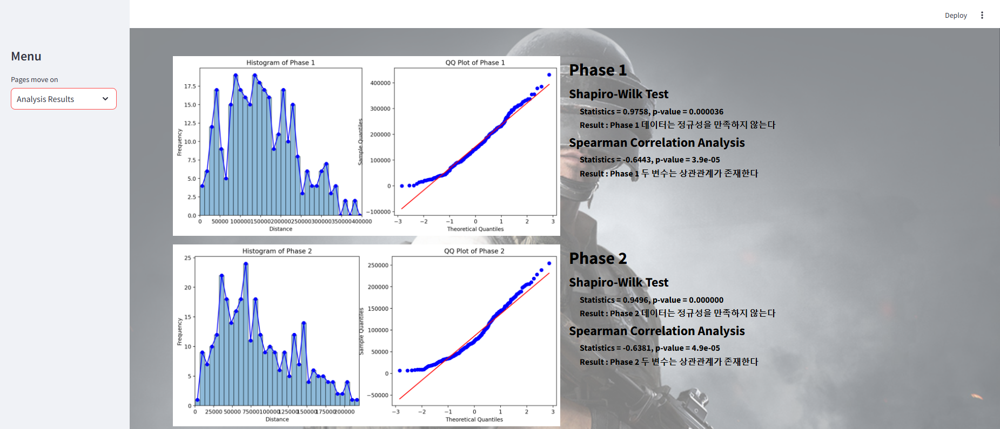
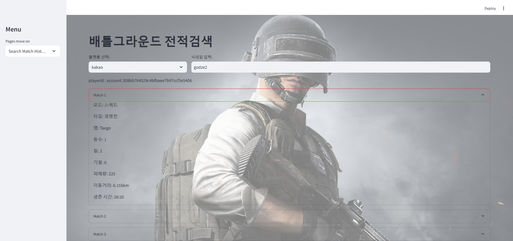

# Streamlit Frontend UI
## 📄 개발 환경 
* Python version : 3.9.10
* OS : Windows 11
* IDE : pycharm
* Packages:
  * streamlit == 1.36.0
  * scipy == 1.13.1
  * requests == 2.32.3
  * pandas == 2.2.2
  * pip == 24.1
  * setuptools == 58.1.0
## 📄 UI Design
### Main page

* Home page
### Analysis Results page

* Second page
  * Content
    * 유저들의 기하학적 중심과 실제 whitezone의 중심이 생성되는 빈도가 높은지 상관관계 분석 및 시각화
  * Result
    *  생성되는 whitezone 1~8의 위치 모두 유저들의 기하하적 중심과 유의미한 상관관계를 갖고 이는 생성위치가 유사함을 의미
### Search Match History page

* Third page
  * Content
    * 유저들의 전적 검색 - (플랫폼, 닉네임)
      * 게임모드
      * 게임 타입
      * 게임 맵
      * 등수
      * 킬 수
      * 기절시킨 횟수
      * 피해량
      * 이동거리
      * 생존시간